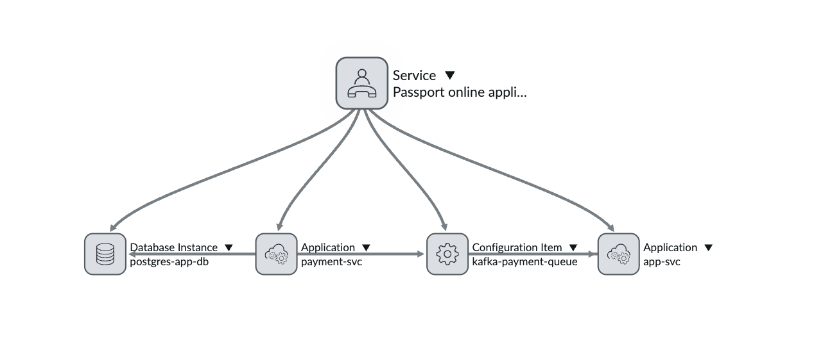

# AIOps Business Value Demo — Presenter Guide

## The Point

This demo shows how Ansible Automation Platform (AAP) with Event-Driven Ansible (EDA) and Ansible Lightspeed Intelligent Assist (ALIA) can **dramatically reduce Mean Time To Resolution (MTTR)** for complex, cross-team incidents.

The scenario is deliberately subtle — a partial failure that doesn't trigger traditional monitoring. Services are up, health checks pass, but citizens are stuck. In the real world, this kind of issue bounces between teams for days. Here, it's diagnosed in under 60 seconds.

---

## The Scenario

**UK Passport Online Application Service** — citizens submit passport applications and pay fees. Standard adult applications are stuck at "Payment Received" and never progress. Premium and child applications work fine.

**Root cause:** A routing misconfiguration in the payment service sends `fee.standard.adult` payments to a dead letter queue instead of the main processing topic. Services are healthy. No alerts fire. Citizens just wait.

**Why this is hard without automation:**
- No single team owns the full picture
- Health checks all pass (it's not an outage)
- The symptom (stuck applications) is in a different system than the cause (routing config)
- Traditional debugging means ticket ping-pong between app team, middleware team, and storage team

---

## The Flow

### 1. Incident Created (ServiceNow)
A call centre agent raises an incident: "Passport applications stuck at payment stage."

**Business value:** This is the trigger. In the old world, this ticket sits in a queue for hours before anyone looks at it.

### 2. Event-Driven Ansible Detects It
The EDA rulebook polls ServiceNow for new incidents (state=1). Within 10 seconds of the incident being created, EDA triggers the workflow automatically.

**Business value:** Zero human latency. No waiting for someone to pick up the ticket, read it, decide who to assign it to.

### How CMDB Parameters Flow Into Diagnostics

```
┌─────────────────────────────────────────────────────────────────────────────┐
│                         ServiceNow CMDB                                      │
│                                                                              │
│   Business Service: "Passport Online Application Service"                    │
│       ├── payment-svc        (cmdb_ci_appl)                                  │
│       ├── app-svc            (cmdb_ci_appl)                                  │
│       ├── kafka-payment-queue (cmdb_ci_messaging_server)                     │
│       └── postgres-app-db    (cmdb_ci_db_instance)                           │
└────────────────────────────────┬────────────────────────────────────────────┘
                                 │
                                 ▼
┌─────────────────────────────────────────────────────────────────────────────┐
│                        CMDB Lookup Playbook                                   │
│                                                                              │
│   Resolves service graph → derives parameters by component class:            │
│                                                                              │
│   cmdb_ci_appl           → application_params.endpoints = [payment-svc,      │
│                             app-svc], ports = {payment-svc: 5000, ...}        │
│   cmdb_ci_messaging_server → message_queue_params.broker_name,               │
│                              topic_name, dlq_topic_name, kafdrop_url          │
│   cmdb_ci_db_instance    → database_params.host, db_name, port               │
│                            → storage_params.host, threshold_pct               │
└───────┬──────────────┬──────────────┬──────────────┬────────────────────────┘
        │              │              │              │
        ▼              ▼              ▼              ▼
┌──────────────┐ ┌───────────────┐ ┌────────────┐ ┌────────────────┐
│  Diagnose    │ │  Diagnose     │ │  Diagnose  │ │  Diagnose      │
│  Application │ │  Message Queue│ │  Storage   │ │  Database      │
│              │ │               │ │            │ │                │
│ Uses:        │ │ Uses:         │ │ Uses:      │ │ Uses:          │
│ • endpoints  │ │ • kafdrop_url │ │ • host     │ │ • host         │
│ • ports      │ │ • topic_name  │ │ • domain   │ │ • db_name      │
│ • domain     │ │ • dlq_topic   │ │ • threshold│ │ • port         │
│              │ │ • broker_name │ │            │ │ • domain       │
│ Skips if     │ │               │ │ Skips if   │ │                │
│ endpoints=[] │ │ Skips if      │ │ host=''    │ │ Skips if       │
│              │ │ kafdrop_url=''│ │            │ │ host=''        │
└──────┬───────┘ └──────┬────────┘ └─────┬──────┘ └───────┬────────┘
       │                │                 │                │
       └────────────────┴────────┬────────┴────────────────┘
                                 │
                                 ▼
                    ┌─────────────────────────┐
                    │       AI Router          │
                    │  (aggregates all         │
                    │   diagnostic reports)    │
                    └────────────┬────────────┘
                                 │
                                 ▼
                    ┌─────────────────────────┐
                    │   Update SNOW Incident   │
                    │  (posts analysis to      │
                    │   work notes)            │
                    └─────────────────────────┘
```

**Key point:** Each diagnostic playbook is completely generic. It has no idea what service it's investigating. The CMDB Lookup is the single point that translates "this incident affects the Passport service" into "check these specific endpoints, this specific queue, this specific database." Swap the business service to a different one, and the same playbooks diagnose completely different infrastructure.

---

### 3. CMDB Lookup (Service Reliability Team)
The workflow's first step queries the ServiceNow CMDB to resolve the service graph:



The service graph shows the **Passport online application service** depends on: `payment-svc`, `kafka-payment-queue`, `app-svc`, `postgres-app-db`

It then **derives operational parameters** from each CMDB component record — based on the component's class — and publishes them for the downstream diagnostic nodes:

| CMDB Component | Class | Parameters Derived |
|---------------|-------|-------------------|
| `kafka-payment-queue` | Message Queue | Kafdrop URL, topic name (`payments`), DLQ topic name (`payments.dlq`), broker hostname |
| `payment-svc` / `app-svc` | Application | Health endpoint URLs for each service |
| `postgres-app-db` | Database Instance | Database hostname, database name (`passports`) |
| (storage host) | Database Instance | Storage hostname for disk capacity checks |

**This is critical:** The diagnostic playbooks are generic — they don't know about passports, Kafka topic names, or which database to check. The CMDB provides those parameters. Without the CMDB Lookup, the diagnostics literally don't know what to target.

**Why this matters at scale:** An enterprise has hundreds of message queues with different names, thousands of database instances, and complex service dependencies. When an incident arrives, the CMDB Lookup answers the question: "For *this* service, which specific queue, which database, which application endpoints need checking?" No human has to remember that. No runbook goes stale.

**The alternative (without CMDB):** A human receives the ticket, thinks "Passport service... I think that uses Kafka... the topic might be called payments... or maybe passport-payments? Let me check... who manages that queue again?" — 30 minutes gone before diagnostics even start.

### 4. Parallel Diagnostics (Four Teams, Simultaneously)

The workflow fans out to four different organisational teams — all running in parallel:

| Node | Team | What it checks | Parameters from CMDB |
|------|------|---------------|---------------------|
| Diagnose Application | Application Services | Health endpoints for payment-svc and app-svc | Endpoint URLs |
| Diagnose Message Queue | Middleware Services | Kafka topic stats, DLQ message counts via Kafdrop | Topic name, DLQ name, Kafdrop URL |
| Diagnose Storage | Storage Services | Disk capacity on the storage host | Hostname |
| Diagnose Database | Database Services | Database connectivity and query health | DB hostname, DB name |

Each diagnostic playbook is **generic and reusable**. It doesn't know about passports or payments — it receives parameters from the CMDB Lookup (topic names, URLs, hostnames, DB names) and runs its standard checks against those targets. If the CMDB didn't identify a relevant component for a team, that diagnostic **skips cleanly** — no errors, no wasted time.

**Business value:** Four teams' expertise encoded as automation, running simultaneously. In the manual world, you'd raise a ticket to each team, wait for them to investigate one at a time, and hope they report back. Here it takes 5 seconds total.

**The cross-silo story:** Each team owns and maintains their own diagnostic playbooks in their own AAP organisation. The Service Reliability team orchestrates them via the workflow. Nobody had to build a monolithic "check everything" script — each team contributed their domain expertise independently.

**The CMDB connection:** Without step 3, these playbooks would either need to be hardcoded per-service (fragile, doesn't scale) or run against everything (slow, noisy). The CMDB makes them both generic AND precise — they know exactly what to check because the service graph told them.

### 5. AI Router (Service Reliability Team)
All diagnostic results converge here. ALIA receives:
- The incident description
- The Kafka diagnostics (showing ~47% of payments are in the DLQ)
- The application diagnostics (all services healthy)
- The storage diagnostics (capacity fine)
- The database diagnostics (connections healthy)

ALIA produces a structured root cause analysis with step-by-step remediation.

**Business value:** The AI correlates data from four different domains simultaneously — something that would take a human engineer significant time to piece together. It identifies that the DLQ accumulation + healthy services + healthy database = routing misconfiguration, not an outage or resource problem.

### 6. Update SNOW Incident (Service Reliability Team)
The AI analysis is posted directly to the incident's work notes and the state is advanced to "In Progress".

**Business value:** The incident now contains actionable remediation steps before any human has even looked at it. An engineer picking up this ticket has a clear path to resolution instead of starting from scratch.

---

## Key Messages

### Time
- **Before:** Incident raised → assigned → reassigned → investigated → root cause found → fixed. Typically 4-48 hours for a subtle issue like this.
- **After:** Incident raised → diagnosed → remediation steps provided. Under 60 seconds.

### Tribal Knowledge
- Diagnostic expertise is codified in reusable playbooks, not locked in people's heads
- The CMDB service graph replaces "ask Dave, he knows how this connects"
- New team members benefit from day one

### Team Collaboration Without Ticket Ping-Pong
- Four teams' diagnostics run in parallel without any human coordination
- No "I've checked my bit, it's not us, reassigning to middleware"
- The workflow crosses organisational silos automatically

### Precision Over Brute Force
- The CMDB scopes the investigation to only affected components
- Diagnostic playbooks skip cleanly when their component isn't in the service graph
- At scale (hundreds of services), this prevents wasted compute and noisy false results

---

## Talking Points for Q&A

**"Could the AI just figure this out without the diagnostics?"**
No. Without real data, the AI guesses. With the DLQ message counts and healthy service endpoints as evidence, it can pinpoint routing as the cause. Garbage in, garbage out — the diagnostics give it facts.

**"Why not just have better monitoring/alerting?"**
This failure doesn't trigger alerts. Services are up. No error rates spike. The only symptom is that applications stop progressing — which looks identical to "nobody submitted an application" from a metrics standpoint. This is the class of problem that monitoring misses.

**"What if the CMDB is wrong or incomplete?"**
Valid concern. The diagnostic playbooks skip gracefully when parameters are missing. An incomplete CMDB means fewer diagnostics run, not a failure. This actually incentivises teams to maintain their CMDB — because accurate data leads to faster resolution.

**"Do teams need to change how they work?"**
No. Each team writes their diagnostic playbooks in their own org, using their own project. The Service Reliability team wires them into the workflow. Teams don't need to know about EDA or ALIA — they just maintain good operational playbooks.

**"What about remediation — does it auto-fix?"**
Not in this demo. The AI recommends steps; a human approves. But the architecture supports it — you could add a remediation node after the AI Router that launches a fix playbook with approval gates. The point is: you've gone from "we don't know what's wrong" to "here's exactly what to do" in under a minute.
